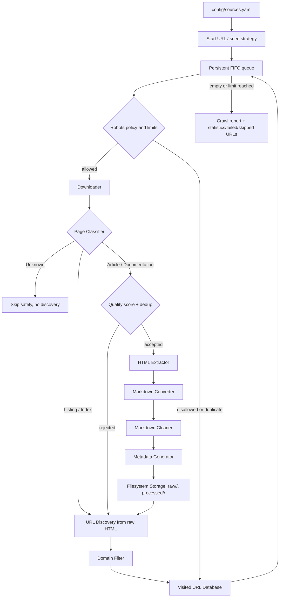

# Knowledge Collector Architecture

## Integrated crawl pipeline

Each queued page follows this order. A page is marked visited only after
classification has decided what, if anything, to save. That makes a failed
or rejected page retryable and prevents a partially processed page from being
treated as completed. Listing/Index pages are never sent to extraction --
this is what fixes crawlers that previously assumed every page was an
article and broke on hub pages such as `https://portswigger.net/research`.

## Page classification

`PageClassifier` (`crawler/classifier.py`) scores every downloaded page
against five generic categories -- Listing, Article, Documentation, Index,
Unknown -- using only structural and URL-shape signals (link density,
heading density, breadcrumbs, `<article>`/`<main>` presence, card-grid link
patterns). No website is named in this logic, so the same classifier works
for OWASP, PortSwigger, HackTricks, ProjectDiscovery, Assetnote, and any
future source declared in `config/sources.yaml`.

`ClassifyingCrawlPageProcessor` (`crawler/page_processor.py`) is the adapter
that acts on a classification: Listing/Index pages are queued for further
discovery without being saved; Article/Documentation pages are quality-scored
(`crawler/content_quality.py`), deduplicated by content hash
(`crawler/dedup.py`), and run through the standard extraction pipeline;
Unknown pages are skipped safely. The historical `WorkflowCrawlPageProcessor`
(no classification) is preserved unchanged for backward compatibility.

## Responsibilities and dependencies

| Component | Responsibility | Depends on |
| --- | --- | --- |
| `SourceRegistry` / `SourceConfig` | Loads and validates `config/sources.yaml`; the CLI's source choices are derived from this at runtime. | PyYAML only |
| `GenericCollector` + seed strategies | Common `crawl()`/`download()`/`extract_links()`/`extract_content()` interface; per-collector-type seeding (HTML start pages, sitemap, RSS). | `SourceConfig`, `Downloader` |
| `PageClassifier` | Classifies one page into Listing/Article/Documentation/Index/Unknown from structural signals. | BeautifulSoup only |
| `ContentQualityScorer` | Scores extracted content quality instead of a fixed character minimum. | BeautifulSoup only |
| `ContentHashStore` / `canonicalize_url` | SHA-256 content dedup and URL-variant normalization. | Filesystem (hash store only) |
| `PageMetadataStore` | Per-URL ETag/Last-Modified/hash bookkeeping for incremental, changed-only recrawls. | Filesystem |
| `CollectionWorkflow` | Coordinates one page through download, extraction, conversion, cleaning, metadata, and storage. | Narrow stage protocols |
| `ClassifyingCrawlPageProcessor` | Classifies, then routes a page through discovery-only or full collection. | `CollectionWorkflow`, `PageClassifier`, `ContentQualityScorer`, `ContentHashStore` |
| `BFSCrawler` | Owns traversal state, limits (including `max_pages=0` = unlimited), robots policy, queue/checkpoints, URL discovery, filtering, deduplication, and statistics. | `CrawlPageProcessor` protocol and crawler services |
| `URLDiscoveryEngine` | Resolves and normalizes links from the raw page HTML. | BeautifulSoup only |
| `DomainFilter` | Keeps same-site, likely HTML URLs. | URL values only |
| `VisitedURLDatabase` | Persists completed URLs for deduplication and resumption. | Filesystem only |
| `CrawlReportGenerator` | Creates JSON and Markdown summaries after traversal; the CLI additionally writes `crawl_statistics.json`, `failed_urls.json`, and `skipped_urls.json`. | Crawl statistics and configuration |

The crawler depends on `CrawlPageProcessor`, not on extraction or storage
implementations. `ClassifyingCrawlPageProcessor` is the production adapter
used by the CLI; `WorkflowCrawlPageProcessor` remains available for callers
that intentionally want the pre-classification behavior. The standard page
pipeline is composed once by `create_default_collection_workflow`, which is
also used by the single-page collectors. This prevents duplicate
orchestration code.

## Runtime sequence

1. `main.py` loads `SourceRegistry` from `config/sources.yaml` at startup;
   every enabled source automatically becomes a `--source` CLI choice.
2. The CLI creates a shared `Downloader`, the standard `CollectionWorkflow`,
   and a `ClassifyingCrawlPageProcessor` for the chosen source/category/language.
3. `BFSCrawler` dequeues a same-site URL and applies limits, visited checks,
   and robots policy. `max_pages=0` disables the page limit entirely; the
   crawl then stops only when the queue is empty or robots.txt disallows
   further URLs.
4. The processor downloads once, classifies the page, and either queues its
   links (Listing/Index), skips it safely (Unknown), or runs it through
   quality scoring, content-hash deduplication, and the collection pipeline
   (Article/Documentation), storing raw HTML and Markdown under a
   per-source folder (`raw/<source>/`, `processed/<source>/`).
5. The crawler marks the URL visited, records byte metrics, discovers links
   from the raw HTML, filters them to the source domain, and queues unseen
   URLs.
6. Checkpoints make unfinished queue entries resumable. Completion produces
   results, summary, statistics, failed/skipped URL lists, and
   dashboard-ready crawl reports.

## Deliberate boundaries

Chunking, embeddings, vector stores, and external databases are not part of
this architecture. They remain future consumers of persisted Markdown rather
than dependencies of crawling or collection. The Playbook Learning Engine
(observation extraction, playbook generation, reasoning/planner logic) is a
separate component and is intentionally untouched by this collector.

